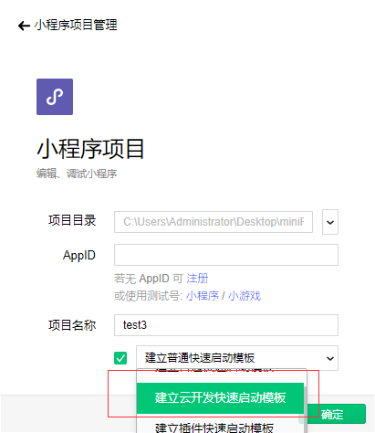
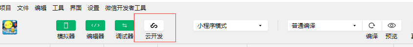

# 小程序云开发前言篇

小程序“云开发”的发布，给小程序注入了一剂猛料，注定会掀起一个小程序狂潮。

## 一：小程序“云开发”的能力

先来看看小程序“云开发”有什么能力。

+ 云函数：在云端运行的代码，微信私有协议天然鉴权，开发者只需编写自身业务逻辑代码

+ 数据库：一个既可在小程序前端操作，也能在云函数中读写的 JSON 数据库

+ 存储：在小程序前端直接上传/下载云端文件，在云开发控制台可视化管理

这些能力翻译过来就是：

+ 1.你不用再租服务器啦，开通小程序“云开发”即可免费存储数据及文件。（目前来说是免费的，以后不好说，但花钱也是值的，少做了好多工作好伐。）

+ 2.以后你不需要后台给你写接口啦，你可以接入小程序“云开发”在js文件中通过微信提供的API可以直接存取数据啦！

+ 3.对于一些复杂的业务逻辑，小程序“云开发”还贴心地发布了“云函数”来给用户。

可以看见的是，小程序“云开发”的公布，对于一些个人小程序、微小企业的小程序来说，是极大的利好，以前需要2个人才能做的事情，现在一个人也能做啦，还不用出钱租服务器啦，嗯。。。我一个PHP的这么兴奋干嘛...

## 二：小程序“云开发”开始

用过leancloud的朋友们可能对小程序“云开发”肯定有一种很熟悉的感觉，其实它俩的用法是很相似的，但是小程序“云开发”更加方便简单。下面开始小程序“云开发”之旅吧，本篇只是入门篇。

### 1.开始

首先把微信开发者工具升级到最新版本，也就是2018-09-10发布的版本（v1.02.1809101）

其次，新建小程序项目，并选择“建立云开发启动模板”，如下图。 // 目前暂不知到如何将已有版本也接入云开发中，有知道的朋友希望可以评论告知一下。

 
 
最后，点击微信开发者工具工具栏中，调试器右边的云开发进去，然后同意。如下图。
填写环境名称就可以开通云开发了。
  

注：每个小程序允许创建2个免费的环境。其实是让开发者将开发环境和生产环境分离,但云开发后台不做区分，需要开发者自己在代码中自己进行区分。
 
 

### 2.云函数的部署

再回到微信开发者工具，此时先来熟悉一下操作。

点击头像旁边的 “点击获取openid”，然后跳转界面说是调用失败。（这里调用的是系统初始文件已经写好的云函数，在cloudfunctions/login/index.js中）

调用失败的原因是，没有指定云函数的环境（之前设置名字的那个或是另外1个，如果你创建了2个环境的话。）

解决方法是，选中 cloudfunctions文件夹，右击 ——> 同步云函数/更多设置 ——> 选中cloudfunctions/login文件夹 ——> 右击，选择 创建并部署。

### 3.新建云函数

右键单击 cloudfunctions文件夹，输入云函数的名字。最后别忘了右击该文件夹，选择 创建并部署。

注：此部分要使用npm下载 wx-server-sdk 。

### 4.前端操作数据库和上传图片

照着点就是了，没什么难度。、

注1：小程序“云开发”存取数据要求必须存在集合（也就是表），leancloud的则可以无视是有有该CLASS（也就是表），可能各有侧重吧，这对我们来说没什么影响。

注2：小程序“云开发”和leancloud都无需新建列，直接存数据就OK了。

